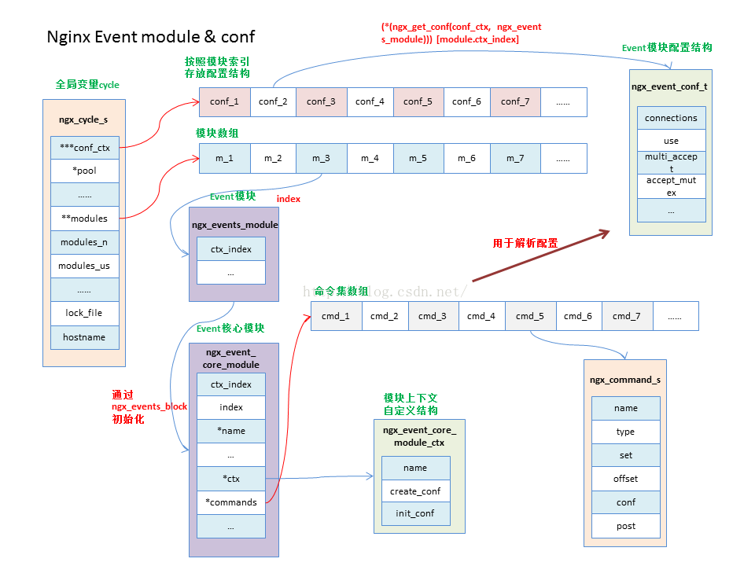

```c
struct ngx_module_s {
    ngx_uint_t            ctx_index;                        // 模块在同类型模块数组中的索引序号
    ngx_uint_t            index;                            // 模块在所有模块数组中的索引序号
    char                 *name;                             // 模块名称

    ngx_uint_t            spare0;                           // 保留变量
    ngx_uint_t            spare1;                           // 保留变量

    ngx_uint_t            version;                          // 模块版本号 目前只有一种，默认为1
    const char           *signature;

    void                 *ctx;                              // 模块上下文，用于放置一个模块自定义的结构
    ngx_command_t        *commands;                         // 模块支持的命令集
    ngx_uint_t            type;                             // 模块类型

    ngx_int_t           (*init_master)(ngx_log_t *log);     // 初始化master主进程调用
    ngx_int_t           (*init_module)(ngx_cycle_t *cycle); // 初始化模块时调用
    ngx_int_t           (*init_process)(ngx_cycle_t *cycle);// 初始化worker工作进程时调用
    ngx_int_t           (*init_thread)(ngx_cycle_t *cycle); // 初始化线程时调用(ginx暂时无多线程模式)
    void                (*exit_thread)(ngx_cycle_t *cycle); // 线程退出时回调
    void                (*exit_process)(ngx_cycle_t *cycle);// 退出工作进程时调用
    void                (*exit_master)(ngx_cycle_t *cycle); // 退出主进程时调用

    uintptr_t             spare_hook0;                      // 保留字段
    uintptr_t             spare_hook1;                      // 保留字段
    uintptr_t             spare_hook2;                      // 保留字段
    uintptr_t             spare_hook3;                      // 保留字段
    uintptr_t             spare_hook4;                      // 保留字段
    uintptr_t             spare_hook5;                      // 保留字段
    uintptr_t             spare_hook6;                      // 保留字段
    uintptr_t             spare_hook7;                      // 保留字段
};
```

```c
#define NGX_MODULE_V1   NGX_MODULE_UNSET_INDEX, NGX_MODULE_UNSET_INDEX, \
                        NULL, 0, 0, nginx_version, NGX_MODULE_SIGNATURE

ngx_module_t ngx_events_module = {
NGX_MODULE_V1,
&ngx_events_module_ctx,                /* module context */
ngx_events_commands,                   /* module directives */
NGX_CORE_MODULE,                       /* module type */
NULL,                                  /* init master */
NULL,                                  /* init module */
NULL,                                  /* init process */
NULL,                                  /* init thread */
NULL,                                  /* exit thread */
NULL,                                  /* exit process */
NULL,                                  /* exit master */
NGX_MODULE_V1_PADDING
};

```

[](https://img-blog.csdn.net/20160905004817101?watermark/2/text/aHR0cDovL2Jsb2cuY3Nkbi5uZXQv/font/5a6L5L2T/fontsize/400/fill/I0JBQkFCMA==/dissolve/70/gravity/Center)